<!-- ======================================================= -->
<!--                 ANIMATED HEADER BANNER                  -->
<!-- ======================================================= -->

  

 

<!-- ======================================================= -->
<!--                 DEVELOPER TYPING BANNER                 -->
<!-- ======================================================= -->

  

 

<!-- ======================================================= -->
<!--                 STATUS & QUICK LINKS                    -->
<!-- ======================================================= -->

  
  
  
  
  

<!-- ======================================================= -->
<!--                 AI & ENGINEERING MOTTO                  -->
<!-- ======================================================= -->

> ⚡ _"Engineering at the intersection of robust backend systems and autonomous AI."_  
> 🤖 _"From deterministic APIs to generative intelligence — building software that reasons, adapts, and scales."_

---

<!-- ======================================================= -->
<!--             ABOUT ME & ENGINEERING FOCUS                -->
<!-- ======================================================= -->
<table width="100%">
<tr>
<td width="64%" valign="top">

### 👨‍💻 Engineering Mindset & About Me

- 🔭 **Core Specialization:** Architecting scalable full-stack applications with **.NET**, **NestJS**, **Python**, **PHP**, and modern **React / Next.js / TypeScript** frontends.
- 🧠 **AI & Vector Intelligence:** Integrating **Gemini AI & Qdrant Vector DB** for semantic search, vector embeddings, and intelligent recommendations.
- 🏛️ **Architecture & Reliability:** Dedicated to Clean Architecture, RESTful API design, robust domain modeling, and maintainable code.
- ⚡ **Database & Performance:** Designing relational & NoSQL data layers with **MongoDB, SQL Server, PostgreSQL & Redis** for high-throughput workloads.
- 🎯 **Availability:** Open for **Software Engineer**, **.NET Backend**, **Full-Stack**, and **AI Engineer** opportunities.

</td>
<td width="36%" align="center" valign="middle">
  
</td>
</tr>
</table>

---

## 🚀 Featured Projects

| Project & Architecture                                                                     | Description & Key Engineering Highlights                                                                                                                                                                                                                                                                                       | Tech Stack                                                                    |                                                                              Source Code                                                                              |
| :----------------------------------------------------------------------------------------- | :----------------------------------------------------------------------------------------------------------------------------------------------------------------------------------------------------------------------------------------------------------------------------------------------------------------------------- | :---------------------------------------------------------------------------- | :-------------------------------------------------------------------------------------------------------------------------------------------------------------------: |
| **01. Court Management & Automated Booking** _Full-Stack Sports Platform_   | • Built comprehensive full-stack platform with ReactJS and ASP.NET Core Web API following RESTful principles. • Engineered automated conflict-validation algorithms to guarantee zero overlapping reservations. • Optimized SQL Server queries and created responsive dashboards using React Query & Redux.            | `ASP.NET Core` `ReactJS` `SQL Server` `EF Core` `React Query` |  |
| **02. E-Commerce Footwear Platform with AI** _AI-Powered Commerce System_   | • Integrated **Gemini AI & Qdrant Vector DB** for semantic product recommendations and intelligent shopping assistance. • Implemented real-time order notifications and status updates via **SignalR WebSockets**. • Multi-layered security with JWT & RBAC; integrated MoMo and ZaloPay payment gateways.             | `ASP.NET Core` `ReactJS` `SignalR` `Gemini AI` `Qdrant DB`    |                             |
| **03. GiaPhaHub — Ancestral Genealogy** _Family Lineage Visualizer_         | • Designed recursive tree traversal algorithms to accurately render multi-generational family structures. • Built interactive canvas with smooth pan, zoom, and dynamic member relation linking. • Enforced strict TypeScript contracts and clean component architecture for long-term scalability.                    | `TypeScript` `React` `Tailwind CSS` `Tree Algorithms` `Vite`  |                           |
| **04. High-Throughput Movie Streaming Platform** _Low-Latency Media Engine_ | • Implemented **Server-Side Rendering (SSR)** with Node.js to achieve sub-second First Contentful Paint (FCP). • Structured clean Controller-Service architecture with input validation middlewares and error handlers. • Modeled relational MySQL schema for media catalogs, watchlists, and user engagement metrics. | `Node.js` `TypeScript` `Express` `MySQL` `SSR / EJS`          |                              |

---

<!-- ======================================================= -->
<!--                 TECH STACK & ARCHITECTURE               -->
<!-- ======================================================= -->

## 🛠️ Tech Stack & Architecture

<table width="100%">
<tr>
<td valign="top" width="50%">

#### ⚡ Core Backend & System Architecture

- **Frameworks & Languages:** `.NET`, `ASP.NET Core Web API`, `C#`, `NestJS`, `Python`, `Node.js`, `Express.js`, `FastAPI`, `PHP`
- **ORM & Data Layer:** `Entity Framework Core`, `Prisma`, `Mongoose`, `Code-First`, `LINQ`
- **Real-Time & Security:** `SignalR WebSockets`, `Socket.io`, `JWT`, `RBAC`, `Clean Architecture`
- **API Standards:** `RESTful API Architecture`, `Swagger / OpenAPI`

#### 🧠 AI & Vector Intelligence

- **AI Models & LLMs:** `Gemini AI Integration`, `OpenAI API`, `Prompt Engineering`
- **Vector Search:** `Qdrant Vector DB`, `Semantic Embeddings`, `RAG Pipelines`
- **AI Tooling & ML:** `Python AI Automation`, `PyTorch`, `LangChain`, `Claude`, `ChatGPT`, `Cursor AI`

  
  
  
  
  
  

</td>
<td valign="top" width="50%">

#### 💻 Frontend & Client Experience

- **Core:** `React 19`, `TypeScript`, `JavaScript (ES6+)`, `Next.js`, `Vite`, `HTML5 / CSS3`
- **State & Data Fetching:** `React Query`, `Redux Toolkit`, `Context API`, `Axios`
- **Styling & UI:** `Tailwind CSS`, `Modern CSS`, `Responsive UX / UI`

#### 🗄️ Database, Caching & DevOps

- **Databases:** `MongoDB (NoSQL)`, `Microsoft SQL Server`, `PostgreSQL`, `MySQL`
- **Caching & Performance:** `Redis`, `In-Memory Caching`
- **DevOps & OS:** `Docker`, `Linux / Ubuntu`, `Git Flow`, `GitHub Actions`, `Postman`

</td>
</tr>
</table>

  
  
  
  
  
  
  
  
  
  
  
  
  

---

<!-- ======================================================= -->
<!--                 CONTRIBUTION GRAPH                      -->
<!-- ======================================================= -->

## 📈 Contribution Graph

  <picture>
    <source media="(prefers-color-scheme: dark)" srcset="https://raw.githubusercontent.com/platane/platane/output/github-contribution-grid-snake-dark.svg">
    <source media="(prefers-color-scheme: light)" srcset="https://raw.githubusercontent.com/platane/platane/output/github-contribution-grid-snake.svg">
    
  </picture>

---

<!-- ======================================================= -->
<!--                 CONNECT & FOOTER                        -->
<!-- ======================================================= -->

### 📬 Connect & Collaborate

  
  &nbsp;
  
  &nbsp;
  

  

  Designed &amp; Developed with Modern Engineering Aesthetics • Built by <b>Nguyen Trong Tin</b>

